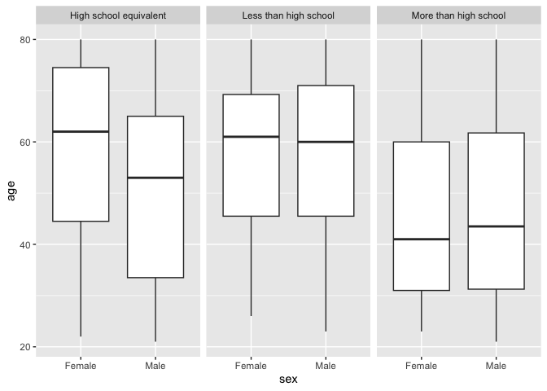

p8105_hw3_eih2108
================
Ekaterina Hofrenning
2023-10-10

# Load Libraries

``` r
library(readr)
library(tidyverse)
library(scrutiny)
library(knitr)
library(p8105.datasets)
```

# Question 1

    The goal is to do some exploration of this dataset. To that end, write a short description of the dataset, noting the size and structure of the data, describing some key variables, and giving illstrative examples of observations. Then, do or answer the following (commenting on the results of each):

    - How many aisles are there, and which aisles are the most items ordered from?
    - Make a plot that shows the number of items ordered in each aisle, limiting this to aisles with more than 10000 items ordered. Arrange aisles sensibly, and organize your plot so others can read it.
    - Make a table showing the three most popular items in each of the aisles “baking ingredients”, “dog food care”, and “packaged vegetables fruits”. Include the number of times each item is ordered in your table.
    - Make a table showing the mean hour of the day at which Pink Lady Apples and Coffee Ice Cream are ordered on each day of the week; format this table for human readers (i.e. produce a 2 x 7 table).

``` r
data("instacart")

aisles_num <- length(unique(instacart$aisle))
aisle_df <- instacart %>% 
  group_by(aisle) %>% 
  summarise(count = n()) %>% 
  arrange(desc(count))
```

There are 134 aisles and fresh veggies and fruits are the top two
aisles.

``` r
aisle_10000plus <- aisle_df %>% 
  filter(count > 10000)

ggplot(aisle_10000plus, aes(x = count, y = reorder(aisle, count))) +
  geom_bar(fill = "pink", stat = "identity") + 
  labs(title = "Number of Orders from Each Aisle", 
       x = "Aisle Names",
       y = "Count")
```

<!-- -->

``` r
bake_ing <- subset(instacart, aisle == "baking ingredients") %>% 
  group_by(product_name) %>% 
  summarise(count = n()) %>% 
  arrange(desc(count))
head(bake_ing)
```

    ## # A tibble: 6 x 2
    ##   product_name                         count
    ##   <chr>                                <int>
    ## 1 Light Brown Sugar                      499
    ## 2 Pure Baking Soda                       387
    ## 3 Cane Sugar                             336
    ## 4 Premium Pure Cane Granulated Sugar     329
    ## 5 Organic Vanilla Extract                327
    ## 6 Organic Unbleached All-Purpose Flour   291

# Question 2

    First, do some data cleaning:
    - format the data to use appropriate variable names
    - focus on the “Overall Health” topic (filter down)
    - include only responses from “Excellent” to “Poor”
    - organize responses as a factor taking levels ordered from “Poor” to “Excellent”

``` r
data("brfss_smart2010")

brfss <- brfss_smart2010 %>% 
  separate(Locationdesc, into = c("State", "County"), sep = "-") %>% # create appropriate state & cty vars
  select(-c(Locationabbr)) %>%
  filter(Topic == "Overall Health", 
         Response %in% c("Poor", "Fair", "Good", "Very Good", "Excellent")) %>%
  mutate(Response = as.factor(Response)) # make factor
```

    Using this dataset, do or answer the following (commenting on the results of each):

    In 2002, which states were observed at 7 or more locations? What about in 2010?

``` r
brfss %>%
  filter(Year == 2002) %>%
  group_by(State) %>%
  summarize(num = n_distinct(GeoLocation)) %>%
  filter(num >= 7)

brfss %>%
  filter(Year == 2010) %>%
  group_by(State) %>%
  summarize(num = n_distinct(GeoLocation)) %>%
  filter(num >= 7)
```

In 2007, CT, FL, MA, NC, NJ and PA were observed at 7 or more locations.
In 2010, CA, CO, FL, MA, MD, NC, NE, NJ, NY, OH, PA, SC, TX, and WA were
observed at 7 or more locations.

    Construct a dataset that is limited to Excellent responses, and contains year, state, and a variable that averages the data_value across locations within a state. 

``` r
brfss_avg <- brfss %>%
    filter(Response == "Excellent") %>% # limit to Excellent
    select(Year, State, GeoLocation, Data_value) %>%
    group_by(Year, State) %>%
    summarise(mean_data_value = mean(Data_value)) %>% # average data_value across geo-locations within a state
    ungroup()
```

The above dataset is limited to Excellent responses to the overall
health question, and contains year, state, and the average data_value
across the locations within the state.

    Make a “spaghetti” plot of this average value over time within a state (that is, make a plot showing a line for each state across years – the geom_line geometry and group aesthetic will help).

``` r
ggplot(brfss_avg, aes(x = Year, y = mean_data_value, color = State)) +
  geom_point(size = 1, alpha = .5) + 
  geom_line() +
  labs(y = "Average Value", title = "Average Excellent Responses per State by Year")
```

<!-- -->

The plot above shows the average data value per state across each year.
Most states stayed between 17 and 25, with a few outliers.

    Make a two-panel plot showing, for the years 2006, and 2010, distribution of data_value for responses (“Poor” to “Excellent”) among locations in NY State.

``` r
brfss %>%
  filter(Year %in% c(2006, 2010), 
         State == "NY ",
         !is.na(Response)) %>%
  select(Year, County, Response, Data_value) %>%
  arrange(Year, County, Response) %>%
  ggplot(aes(x = Response, y = Data_value)) +
  geom_boxplot() +
  facet_wrap(~Year) +
  labs(x = "Overall Health", y = "Data value", title = "Overall Health and Data Value for 2006 and 2010")
```

<!-- -->

The above plot shows the distribution of data value for each overall
health response in 2006 and 2010. Between 2006 and 2010, the data looks
similar; the “Poor” response groups have the lowest median data value,
the “Fair” response groups have a median data value slightly higher than
10, the “Good” response groups have the highest median data value around
30, and the “Excellent” response group have a median data value in
between the “Fair” and “Good” response groups.

# Question 3

    Load, tidy, merge, and otherwise organize the data sets. Your final dataset should include all originally observed variables; exclude participants less than 21 years of age, and those with missing demographic data; and encode data with reasonable variable classes (i.e. not numeric, and using factors with the ordering of tables and plots in mind).

``` r
covar <- read_csv("./data/nhanes_covar.csv") %>%
  row_to_colnames(row = 4) %>%
  slice_tail(n = 250) %>%
  mutate(SEQN = as.integer(SEQN), 
         sex = as.factor(case_when(sex == 1 ~ "Male", sex == 2 ~ "Female")), 
         age = as.integer(age), 
         BMI = as.double(BMI), 
         education = as.factor(case_when(education == 1 ~ "Less than high school",
                                         education == 2 ~ "High school equivalent",
                                         education == 3 ~ "More than high school"))) %>%
  na.omit() %>%
  filter(age >= 21)

accel <- read_csv("./data/nhanes_accel.csv")

nhanes <- left_join(covar, accel, by = "SEQN") # merge together
```

    Produce a reader-friendly table for the number of men and women in each education category, and create a visualization of the age distributions for men and women in each education category. Comment on these items.

The table below describes the education category and sex breakdowns in
the data. The highest education category and sex combination is Females
with more than a high school degree (59 people). The lowest education
and sex combination is Females with a high school or high
school-equivalent degree.

``` r
# create table
nhanes %>% 
  group_by(education, sex) %>%
  summarize(`Number of People` = n()) %>%
  ungroup() %>%
  rename(Education = education, Sex = sex) %>%
  kable(digits = 1)
```

| Education              | Sex    | Number of People |
|:-----------------------|:-------|-----------------:|
| High school equivalent | Female |               23 |
| High school equivalent | Male   |               35 |
| Less than high school  | Female |               28 |
| Less than high school  | Male   |               27 |
| More than high school  | Female |               59 |
| More than high school  | Male   |               56 |

As seen in the graphic below, females completing high school (or high
school equivalent) have a higher median age than males of the same
education level in our dataset. Similarly, females with less than a high
school degree have a slightly higher median age than males of the same
education level in our dataset. Males with more than a high school
degree have a higher median age than females with the same education
level.

``` r
# create boxplots (sex, age, education)
nhanes %>%
  select(SEQN, sex, age, education) %>%
  ggplot(aes(x = sex, y = age)) +
  geom_boxplot() +
  facet_wrap(~education)
```

<!-- -->

    Traditional analyses of accelerometer data focus on the total activity over the day. Using your tidied dataset, aggregate across minutes to create a total activity variable for each participant. Plot these total activities (y-axis) against age (x-axis); your plot should compare men to women and have separate panels for each education level. Include a trend line or a smooth to illustrate differences. Comment on your plot.

``` r
nhanes_sum <- nhanes %>%
  mutate(activity_per_day = rowSums(select(., contains("min")))) %>%
  select(SEQN:education, activity_per_day)

ggplot(nhanes_sum, aes(x = age, y = activity_per_day, color = sex)) +
  geom_point() +
  geom_smooth(se = F, method = "lm") +
  facet_wrap(~education) +
  labs(y = "Activity level per day", x = "Age", title = "Activity level by Age, Education, and Sex")
```

<!-- -->

My plot displays the total activity level per day for males and females
across each age. We see that older indiviudals tend to have lower total
activity levels per day across all education groups. Females that have
high school equivalent degrees and/or more than a high school degree
have higher activity levels than men with the same education level. For
people with less than a high school degree, it appears that younger
women have a higher activity level than men while older women have a
lower total activity level than men.

    Accelerometer data allows the inspection activity over the course of the day. Make a three-panel plot that shows the 24-hour activity time courses for each education level and use color to indicate sex. Describe in words any patterns or conclusions you can make based on this graph; including smooth trends may help identify differences.

``` r
nhanes %>% 
  pivot_longer(cols = contains("min"), names_to = "minute", values_to = "activity") %>%
  separate(col = minute, "n", into = c("min_char", "min")) %>%
  mutate(min = as.integer(min)) %>%
  ggplot(aes(x = min, y = activity, color = sex)) +
  geom_point(alpha = .03) +
  geom_smooth(se = F) +
  facet_wrap(~education) +
  labs(x = "Minutes", y = "Activity level", title = "Activity level per Minute by Education and Sex")
```

<!-- -->

The plot above indicates that at midnight and into early in the morning,
activity levels are low. Activity levels pick up later in the morning
and remain steady through the afternoon. Then, activity levels drop in
the evening. It also indicates that activity levels among males and
females are similar, and are fairly similar across education groups.
Females with more than a high school degree have slightly higher
activity levels than males with more than a high school degree.
